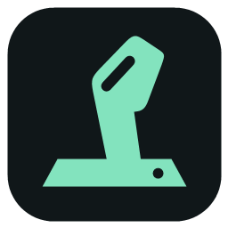

# CHC Custom Hotas Controller

A simple Windows controller mapper with selectable mapping cards, named controls, and multiple actions for each switch or input. Originally developed as StickShift; existing profiles remain compatible.

## Download

**[Download CHC for Windows x64](https://github.com/ElonTuusk/CHC-Custom-Hotas-Controller/releases/latest/download/CHC-Custom-Hotas-Controller-Windows-x64.zip)**

Extract the entire ZIP, then run **CHC.exe**. Keep the Source and Assets folders and both SharpDX DLLs beside the executable. This is a portable, unsigned early release (0.4.0), with no installer.

## Start using CHC

1. Connect your joystick, throttle, pedals, or radio controller.
2. For virtual joystick output, install and configure [vJoy](https://github.com/shauleiz/vJoy). Enable the axes and buttons you need on device 1. vJoy is an external dependency and is not included.
3. Launch CHC.exe. Select your controller, then an input, or use **Detect my next input**.
4. Choose an output and apply the mapping. Use **+ Add action** for another action on the same input, or the two-/three-position presets for a switch represented as an axis.
5. Name your profile and **Save** it. Save personal profiles in the Profiles folder. **Save** remembers the last profile for the next launch; after opening a different profile, save it to make it the startup profile.
6. Press **Start mappings**, then bind the vJoy device in your game. Output starts stopped each time you launch the app. **Ctrl+Alt+F12** stops output.

Use **Rename** to label controls Roll, Pitch, Yaw, Collective, SA, SB, and so on. Switch channel assignments vary by controller: use live detection rather than assuming the Windows axis name is correct. If each position of two two-position and two three-position switches needs a unique button, configure at least 10 vJoy buttons.

The demo controller can be explored without hardware and sends no output. The public download contains only a demo profile, never the author's personal controller mappings.

## Features

- Virtual axes, buttons, and continuous hats through vJoy
- Dead zones, response curves, saturation, inversion, unipolar axes, and axis merging
- Multiple actions per physical input; axis ranges for switch positions
- Keyboard chords, mouse buttons, and text-defined macros
- Modes with Base inheritance and physical-button conditions
- Named controls, live input detection, and selectable mapping cards
- Local XML profiles with an automatic previous-save `.bak` backup

## Requirements and limitations

Windows x64 with .NET Framework 4.8 is recommended. vJoy is required for virtual joystick outputs; keyboard and mouse mappings can work without it. Stop other mappers that are using the same vJoy device.

This early version is inspired by [Joystick Gremlin](https://github.com/WhiteMagic/JoystickGremlin), but is an independent implementation, not a drop-in replacement. It does not import Gremlin profiles or plugins, hide physical controllers, provide force feedback, or auto-select profiles by game. Games can see both physical and virtual devices; clear conflicting game bindings. Keyboard and mouse actions go to the focused application.

Profiles identify controllers by their Windows device instance ID. Changing ports or machines can require recreating mappings for the newly detected device. Keep a backup of your profile before making changes. The app has been tested with a BETAFPV controller and vJoy; other devices and games may behave differently.

## Source code and build

The Windows ZIP includes the complete C# source, XAML interface, artwork, and build script. Extract it before building.

Run `powershell -ExecutionPolicy Bypass -File .\Build.ps1` on Windows x64 with .NET Framework installed. The included SharpDX 4.2.0 libraries are required. No NuGet restore or .NET SDK is needed. Run `CHC.exe --self-test` for mapping logic checks, or `CHC.exe --screenshot` for the demo UI checks and preview.

MIT license. See LICENSE.txt and THIRD-PARTY-NOTICES.txt for attribution and dependency licensing.
